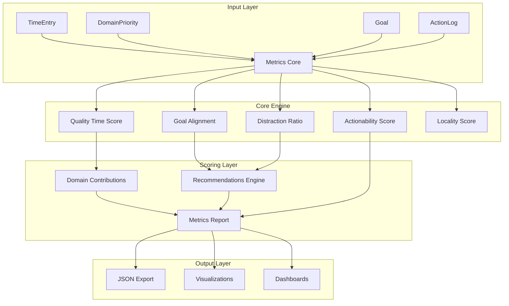
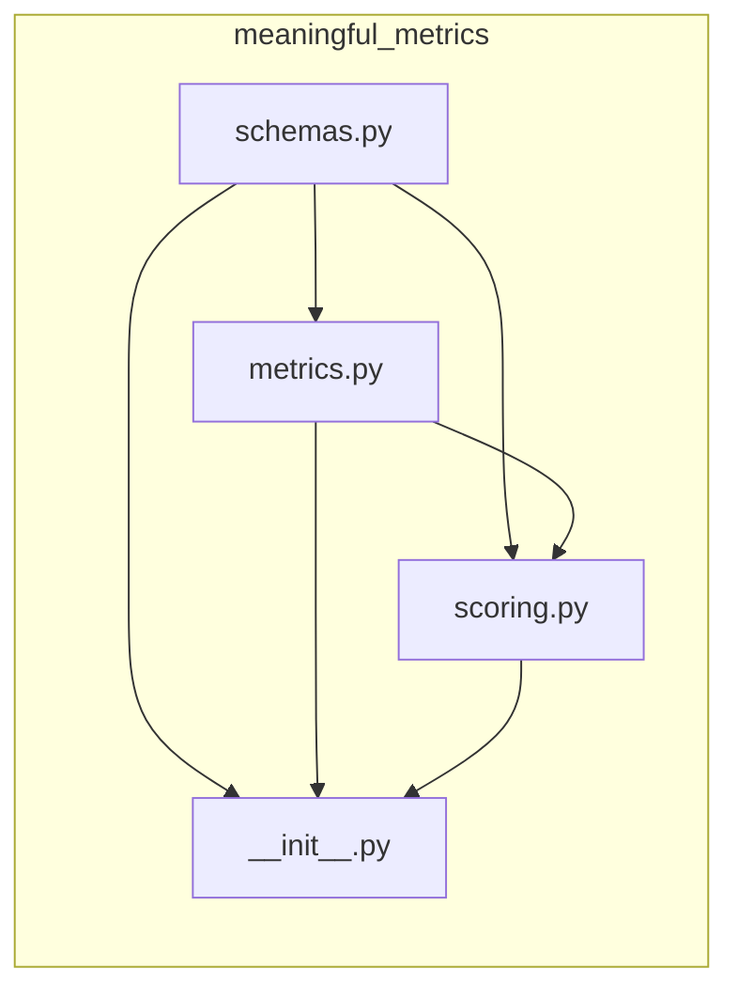
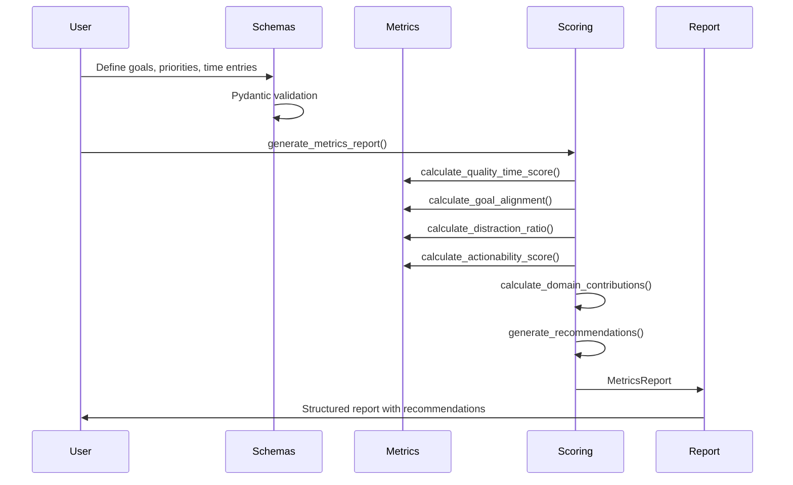

# Architecture

## System Overview

Meaningful Metrics is a Python library that provides a composable framework for evaluating AI systems against human-centered outcomes rather than engagement-maximization proxies. The architecture prioritizes transparency, extensibility, and mathematical rigor.

## High-Level Architecture

## Module Dependency Graph

## Data Flow

## Core Components

### 1. Schema Layer (`schemas.py`)

Pydantic models that enforce data contracts at the boundary. All input validation happens here, ensuring that downstream metric calculations receive well-formed data.

**Key design decisions:**
- Pydantic v2 for runtime validation with type safety
- Strict bounds on numeric fields (priorities 0-1, hours >= 0)
- Optional fields with sensible defaults (e.g., `ActionWeights`)

### 2. Metrics Core (`metrics.py`)

Pure functions that implement the mathematical formulas. Each metric is:

- **Stateless**: No side effects, deterministic output
- **Differentiable**: Smooth approximations available for ML optimization (e.g., `soft_min`)
- **Documented**: Formula, parameters, and edge cases described in docstrings

| Metric | Formula | Range |
|--------|---------|-------|
| Quality Time Score | `sum(min(Ti, Capi) * Pi)` | `[0, inf)` |
| Goal Alignment | `(goal_time / total_time) * 100` | `[0, 100]` |
| Distraction Ratio | `100 - Goal Alignment` | `[0, 100]` |
| Actionability Score | `weighted_actions / consumed` | `[0, inf)` |
| Locality Score | `relevance * engagement` | `[0, 1]` |

### 3. Scoring Layer (`scoring.py`)

Composite functions that aggregate individual metrics into actionable reports. The recommendation engine applies heuristic rules against computed metrics to surface improvement opportunities.

## Design Principles

1. **Composition over inheritance** -- Metrics are standalone functions composed in `generate_metrics_report()`.
2. **Validation at the boundary** -- Pydantic models validate all input; core functions trust their inputs.
3. **Transparency** -- Every formula is documented with LaTeX-style notation in docstrings.
4. **Extensibility** -- New metrics follow the same pattern: define schema, implement function, compose in report.
5. **ML-friendliness** -- Smooth approximations (`soft_min`) enable gradient-based optimization.
